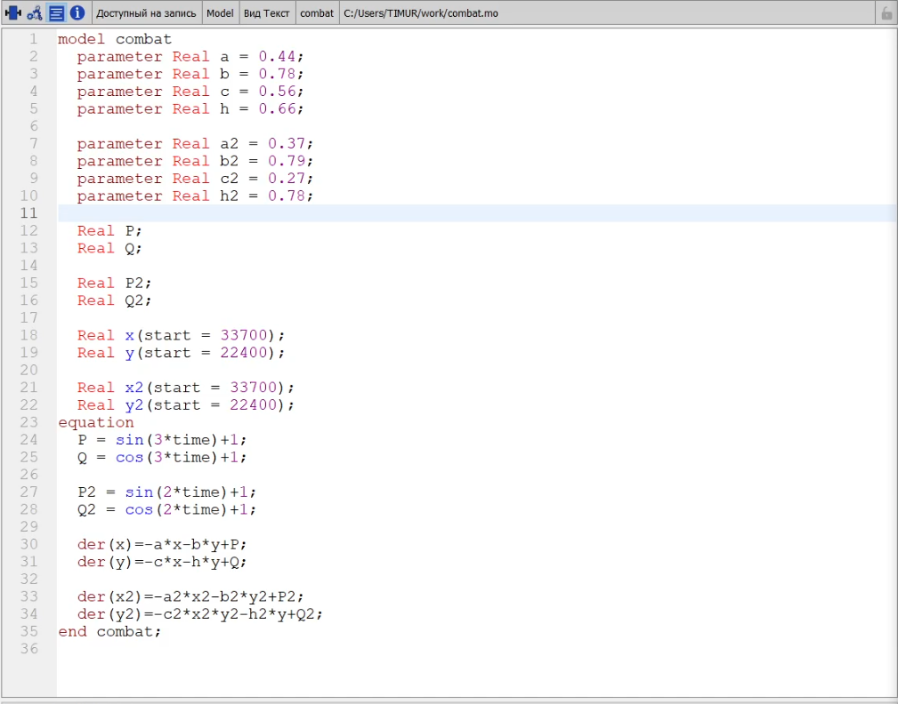
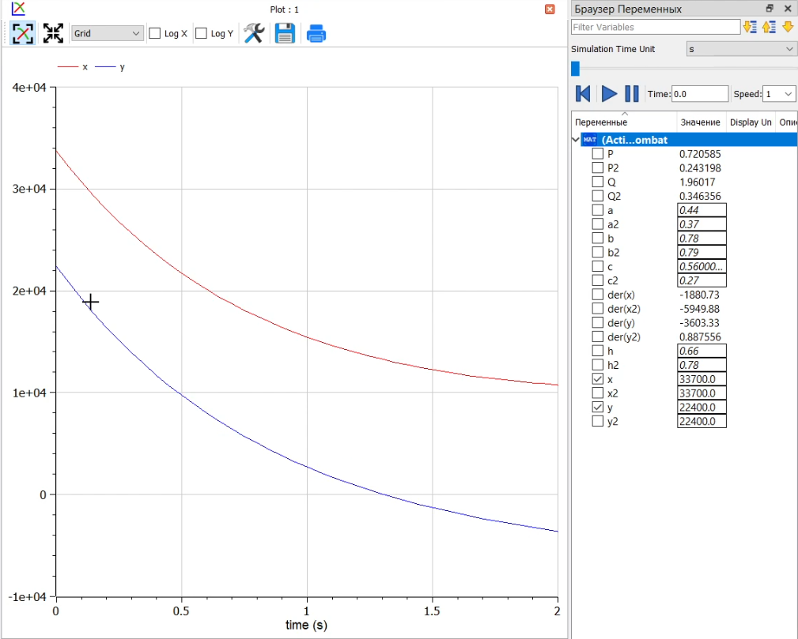
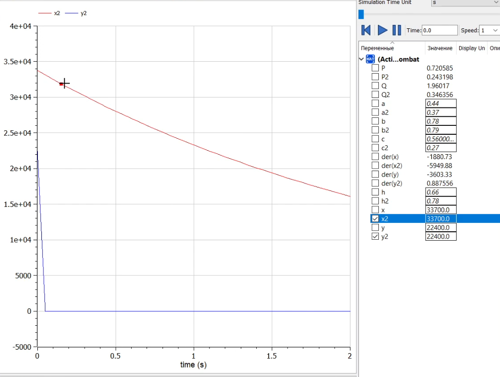

---
## Front matter
lang: ru-RU
title: Презентация по лабораторной работе №3
author: Калинин Тимур Дмитриевич
institute: РУДН
date: 

## Formatting
toc: false
slide_level: 2
theme: metropolis
header-includes: 
 - \metroset{progressbar=frametitle,sectionpage=progressbar,numbering=fraction}
 - '\makeatletter'
 - '\beamer@ignorenonframefalse'
 - '\makeatother'
aspectratio: 43
section-titles: true
---

# Цель выполнения лабораторной работы

Построить модель боевых действий в OpenModelica.

# Задачи выполнения лабораторной работы

## Условия

Вариант 31

Между страной $X$ и страной $Y$ идет война. Численность состава войскисчисляется от начала войны, и являются временными функциями $x(t)$ и $y(t)$ . В начальный момент времени страна $X$ имеет армию численностью 33 700 человек, а в распоряжении страны $Y$ армия численностью в 22 400 человек. Для упрощения модели считаем, что коэффициенты $a, b, c, h$ постоянны. Также считаем $P(t)$ и $Q(t)$ непрерывные функции.

## Задачи

Постройте графики изменения численности войск армии $X$ и армии $Y$ для следующих случаев:

1. Модель боевых действий между регулярными войсками
$$
\frac{dx}{dt}=-0.44x(t)-0.78y(t)+sin(3t)+1
$$
$$
\frac{dy}{dt}=-0.56x(t)-0.66y(t)+cos(3t)+1
$$
2. Модель ведения боевых действий с участием регулярных войск и партизанских отрядов
$$
\frac{dx}{dt}=-0.37x(t)-0.79y(t)+sin(2t)+1
$$
$$
\frac{dy}{dt}=-0.27x(t)y(t)-0.78y(t)+cos(2t)+1
$$

# Результаты выполнения лабораторной

## Код программы

{ #fig:001 width=70%}

## Графики для первого случая

{ #fig:002 width=70%}

## Графики для второго случая

{ #fig:003 width=70%}

# Итог

В результате выполнения лабораторной работы я построил модель боевых действий в OpenModelica.
