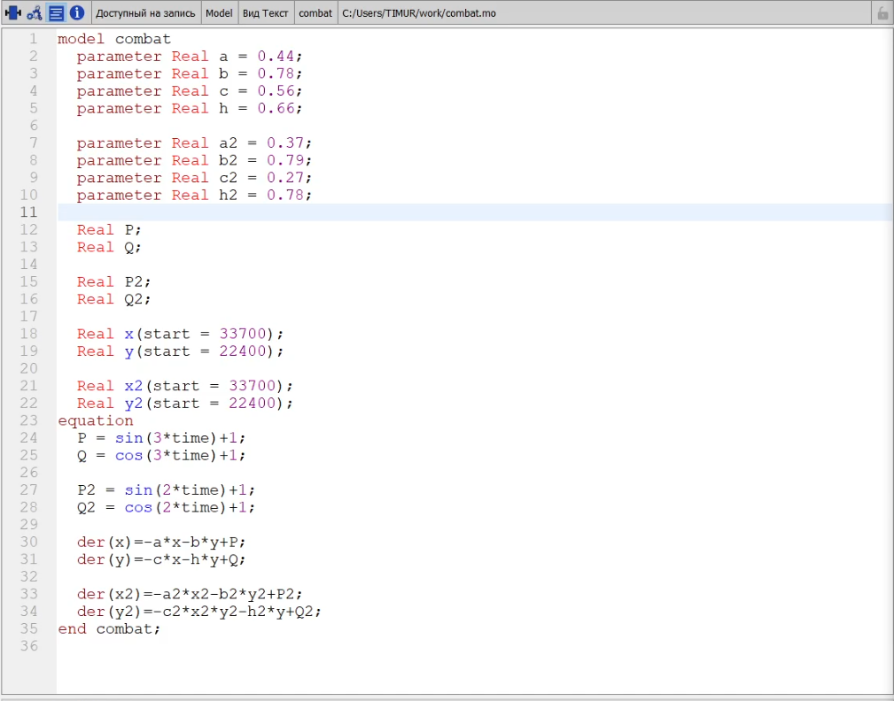
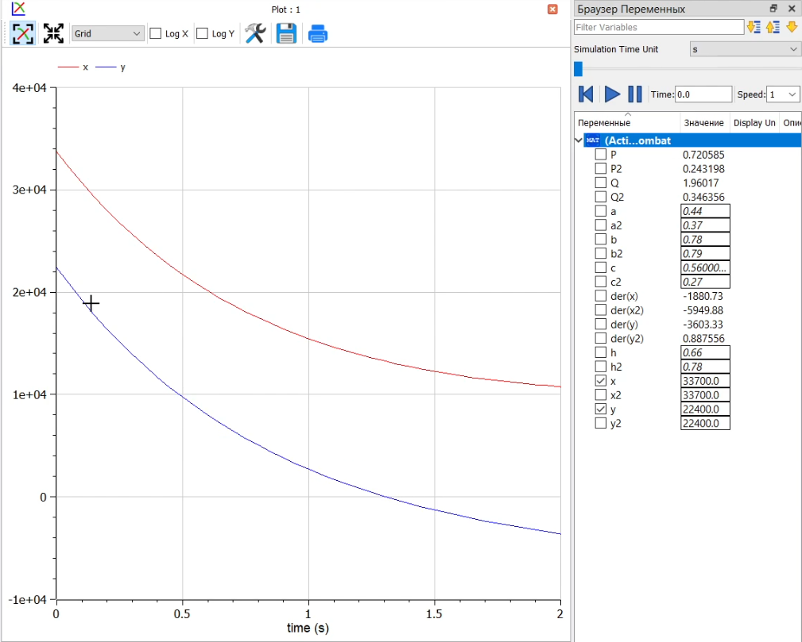
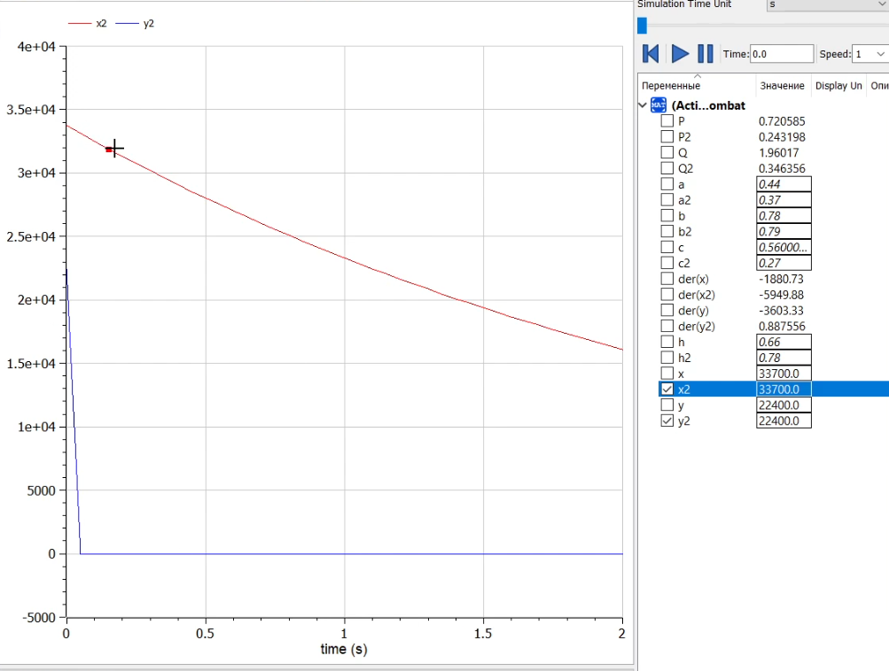

---
# Front matter
title: "Отчёт по лабораторной работе №3"
subtitle: "Модель ведения боевых действий"
author: "Тимур Дмитриевич Калинин"

# Generic otions
lang: ru-RU
toc-title: "Содержание"

# Bibliography

# References settings
linkReferences: true
nameInLink: true

# Pdf output format
toc: true # Table of contents
toc_depth: 2
lof: true # List of figures
lot: false # List of tables
fontsize: 12pt
linestretch: 1.5
papersize: a4
documentclass: scrreprt
## I18n
polyglossia-lang:
  name: russian
  options:
	- spelling=modern
	- babelshorthands=true
polyglossia-otherlangs:
  name: english
### Fonts
mainfont: PT Serif
romanfont: PT Serif
sansfont: PT Sans
monofont: PT Mono
mainfontoptions: Ligatures=TeX
romanfontoptions: Ligatures=TeX
sansfontoptions: Ligatures=TeX,Scale=MatchLowercase
monofontoptions: Scale=MatchLowercase,Scale=0.9
# Biblatex
biblatex: true
biblio-style: "gost-numeric"
biblatexoptions:
  - parentracker=true
  - backend=biber
  - hyperref=auto
  - language=auto
  - autolang=other*
  - citestyle=gost-numeric
## Misc options
indent: true
header-includes:
  - \linepenalty=10 # the penalty added to the badness of each line within a paragraph (no associated penalty node) Increasing the value makes tex try to have fewer lines in the paragraph.
  - \interlinepenalty=0 # value of the penalty (node) added after each line of a paragraph.
  - \hyphenpenalty=50 # the penalty for line breaking at an automatically inserted hyphen
  - \exhyphenpenalty=50 # the penalty for line breaking at an explicit hyphen
  - \binoppenalty=700 # the penalty for breaking a line at a binary operator
  - \relpenalty=500 # the penalty for breaking a line at a relation
  - \clubpenalty=150 # extra penalty for breaking after first line of a paragraph
  - \widowpenalty=150 # extra penalty for breaking before last line of a paragraph
  - \displaywidowpenalty=50 # extra penalty for breaking before last line before a display math
  - \brokenpenalty=100 # extra penalty for page breaking after a hyphenated line
  - \predisplaypenalty=10000 # penalty for breaking before a display
  - \postdisplaypenalty=0 # penalty for breaking after a display
  - \floatingpenalty = 20000 # penalty for splitting an insertion (can only be split footnote in standard LaTeX)
  - \raggedbottom # or \flushbottom
  - \usepackage{float} # keep figures where there are in the text
  - \floatplacement{figure}{H} # keep figures where there are in the text
---

# Цель работы

Построить модель ведения боевых действий в OpenModelica.

# Задание

Вариант 31

Между страной $X$ и страной $Y$ идет война. Численность состава войскисчисляется от начала войны, и являются временными функциями $x(t)$ и $y(t)$ . В начальный момент времени страна $X$ имеет армию численностью 33 700 человек, а в распоряжении страны $Y$ армия численностью в 22 400 человек. Для упрощения модели считаем, что коэффициенты $a, b, c, h$ постоянны. Также считаем $P(t)$ и $Q(t)$ непрерывные функции.

Постройте графики изменения численности войск армии $X$ и армии $Y$ для следующих случаев:

1. Модель боевых действий между регулярными войсками
$$
\frac{dx}{dt}=-0.44x(t)-0.78y(t)+sin(3t)+1
$$
$$
\frac{dy}{dt}=-0.56x(t)-0.66y(t)+cos(3t)+1
$$
2. Модель ведения боевых действий с участием регулярных войск и партизанских отрядов
$$
\frac{dx}{dt}=-0.37x(t)-0.79y(t)+sin(2t)+1
$$
$$
\frac{dy}{dt}=-0.27x(t)y(t)-0.78y(t)+cos(2t)+1
$$

# Теоретическое введение

Рассмотрим некоторые простейшие модели боевых действий – модели Ланчестера. В противоборстве могут принимать участие как регулярные войска, так и партизанские отряды. В общем случае главной характеристикой соперников являются численности сторон. Если в какой-то момент времени одна из численностей обращается в нуль, то данная сторона считается проигравшей (при условии, что численность другой стороны в данный момент положительна).
Рассмотри три случая ведения боевых действий:

1. Боевые действия между регулярными войсками
   
2. Боевые действия с участием регулярных войск и партизанских отрядов
   
3. Боевые действия между партизанскими отрядами.

В первом случае численность регулярных войск определяется тремя факторами:
   
- скорость уменьшения численности войск из-за причин, не связанных с боевыми действиями (болезни, травмы, дезертирство);

- скорость потерь, обусловленных боевыми действиями
противоборствующих сторон (что связанно с качеством стратегии, уровнем вооружения, профессионализмом солдат и т.п.);

- скорость поступления подкрепления (задаётся некоторой функцией от времени).

В этом случае модель боевых действий между регулярными войсками описывается следующим образом

$$
\frac{dx}{dt}=-a(t)x(t)-b(t)y(t)+P(t)
$$
$$
\frac{dy}{dt}=-c(t)x(t)-h(t)y(t)+Q(t)
$$

Потери, не связанные с боевыми действиями, описывают члены $a(t)x(t)$ и $h(t)y(t)$, члены $b(t)y(t)$ и $c(t)x(t)$ отражают потери на поле боя. Коэффициенты $b(t)$ и $c(t)$ указывают на эффективность боевых действий со стороны $y$ и $x$ соответственно, $a(t)$, $h(t)$ - величины, характеризующие степень влияния различных факторов на потери. Функции $P(t)$, $Q(t)$ учитывают возможность подхода подкрепления к войскам $X$ и $Y$ в течение одного дня.

Во втором случае в борьбу добавляются партизанские отряды. Нерегулярные войска в отличии от постоянной армии менее уязвимы, так как действуют скрытно, в этом случае сопернику приходится действовать неизбирательно, по площадям, занимаемым партизанами. Поэтому считается, что тем потерь партизан, проводящих свои операции в разных местах на некоторой известной территории, пропорционален не только численности армейских соединений, но и численности
самих партизан. В результате модель принимает вид:

$$
\frac{dx}{dt}=-a(t)x(t)-b(t)y(t)+P(t)
$$
$$
\frac{dy}{dt}=-c(t)x(t)y(t)-h(t)y(t)+Q(t)
$$

В этой системе все величины имеют тот же смысл.
Модель ведения боевых действий между партизанскими отрядами с учетом предположений, сделанном в предыдущем случаем, имеет вид:

$$
\frac{dx}{dt}=-a(t)x(t)-b(t)x(t)y(t)+P(t)
$$
$$
\frac{dy}{dt}=-c(t)x(t)y(t)-h(t)y(t)+Q(t)
$$

# Выполнение лабораторной работы

1. Напишем программу в OpenModelica, которая будет моделировать поставленную задачу ([Рис. @fig:001]). Программа моделирует сразу две ситуации.

{#fig:001}

2. Запустим ее на исполнение и посмотрим на графики армий из 1-й ситуации (регулярная армия против регулярной, [Рис. @fig:002]). Как видим, выиграла первая армия.

{#fig:002}

3. Теперь посмотрим на графики армий из 2-й ситуации (регулярная армия против партизанской, [Рис. @fig:003]). Как видим, выиграла первая армия.

{#fig:003}

# Выводы

В результате выполнения лабораторной работы мы написали модель боевых действий в OpenModelica.

# Библиография

1. OpenModelica User's Guide. URL: [https://www.openmodelica.org/doc/OpenModelicaUsersGuide/latest/](https://www.openmodelica.org/doc/OpenModelicaUsersGuide/latest/)
2. Лабораторная работа №3. - 4 с. URL: [https://esystem.rudn.ru/mod/resource/view.php?id=831111](https://esystem.rudn.ru/mod/resource/view.php?id=831111)
