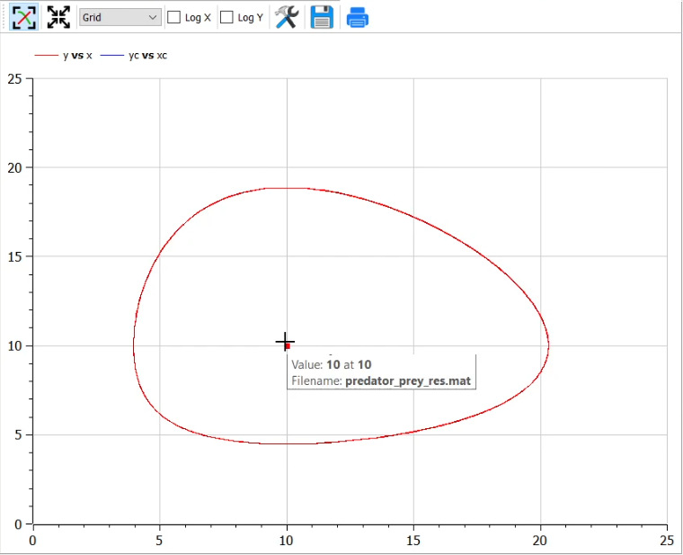

---
## Front matter
lang: ru-RU
title: Презентация по лабораторной работе №5
author: Калинин Тимур Дмитриевич
institute: РУДН
date: 

## Formatting
toc: false
slide_level: 2
theme: metropolis
header-includes: 
 - \metroset{progressbar=frametitle,sectionpage=progressbar,numbering=fraction}
 - '\makeatletter'
 - '\beamer@ignorenonframefalse'
 - '\makeatother'
aspectratio: 43
section-titles: true
---

# Цель выполнения лабораторной работы

Построить модель Лотки-Вольтерры в OpenModelica.

# Задачи выполнения лабораторной работы

## Условия и задача

Вариант 31.

    Для модели «хищник-жертва»:
$$
\begin{cases}
\frac{dx}{dt}=-0.45x(t)+0.045x(t)y(t)\\
\frac{dy}{dt}=0.35y(t)-0.035x(t)y(t)
\end{cases}
$$
Постройте график зависимости численности хищников от численности жертв, а также графики изменения численности хищников и численности жертв при следующих начальных условиях: $x_0=4, y_0=9$. Найдите стационарное состояние системы.

# Результаты выполнения лабораторной

## Код программы

{#fig:001 width=70%}

## Фазовый портрет

{#fig:003 width=70%}

## График численности во времени

{#fig:004 width=70%}

## Код для стационарного состояния

{#fig:005 width=70%}

## График численности во времени

{#fig:006 width=70%}

# Итог

В результате выполнения лабораторной работы мы познакомились с моделью Лотки-Вольтерра и написали ее реализацию в OpenModelica.
