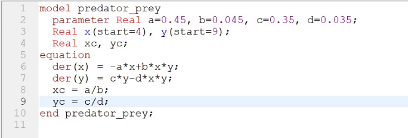
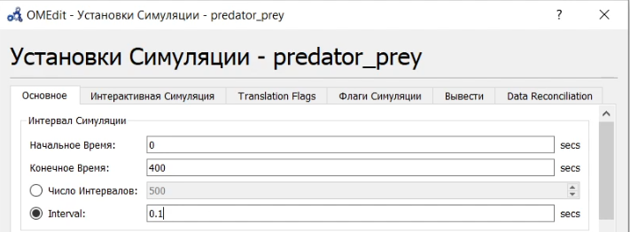
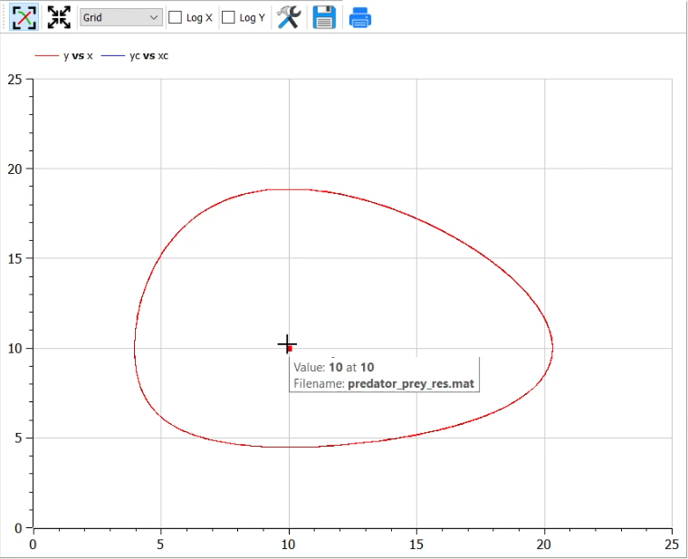
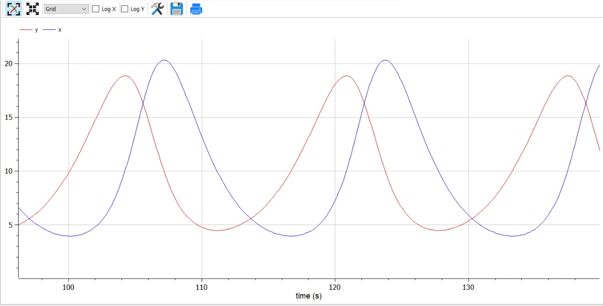
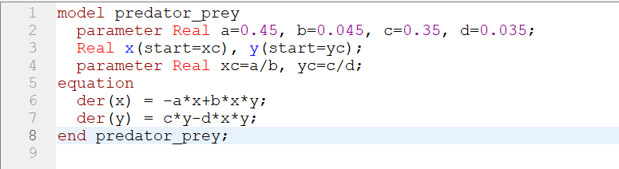
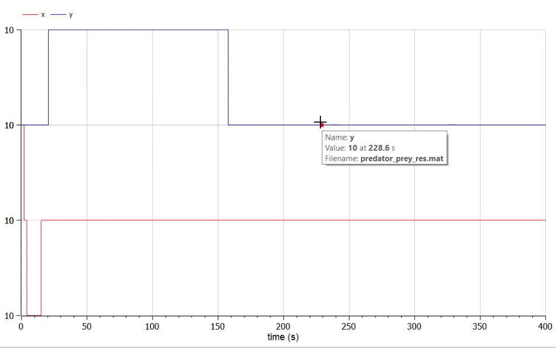

---
# Front matter
title: "Отчёт по лабораторной работе №5"
subtitle: "Модель хищник-жертва"
author: "Тимур Дмитриевич Калинин"

# Generic otions
lang: ru-RU
toc-title: "Содержание"

# Bibliography

# References settings
linkReferences: true
nameInLink: true

# Pdf output format
toc: true # Table of contents
toc_depth: 2
lof: true # List of figures
lot: false # List of tables
fontsize: 12pt
linestretch: 1.5
papersize: a4
documentclass: scrreprt
## I18n
polyglossia-lang:
  name: russian
  options:
	- spelling=modern
	- babelshorthands=true
polyglossia-otherlangs:
  name: english
### Fonts
mainfont: PT Serif
romanfont: PT Serif
sansfont: PT Sans
monofont: PT Mono
mainfontoptions: Ligatures=TeX
romanfontoptions: Ligatures=TeX
sansfontoptions: Ligatures=TeX,Scale=MatchLowercase
monofontoptions: Scale=MatchLowercase,Scale=0.9
# Biblatex
biblatex: true
biblio-style: "gost-numeric"
biblatexoptions:
  - parentracker=true
  - backend=biber
  - hyperref=auto
  - language=auto
  - autolang=other*
  - citestyle=gost-numeric
## Misc options
indent: true
header-includes:
  - \linepenalty=10 # the penalty added to the badness of each line within a paragraph (no associated penalty node) Increasing the value makes tex try to have fewer lines in the paragraph.
  - \interlinepenalty=0 # value of the penalty (node) added after each line of a paragraph.
  - \hyphenpenalty=50 # the penalty for line breaking at an automatically inserted hyphen
  - \exhyphenpenalty=50 # the penalty for line breaking at an explicit hyphen
  - \binoppenalty=700 # the penalty for breaking a line at a binary operator
  - \relpenalty=500 # the penalty for breaking a line at a relation
  - \clubpenalty=150 # extra penalty for breaking after first line of a paragraph
  - \widowpenalty=150 # extra penalty for breaking before last line of a paragraph
  - \displaywidowpenalty=50 # extra penalty for breaking before last line before a display math
  - \brokenpenalty=100 # extra penalty for page breaking after a hyphenated line
  - \predisplaypenalty=10000 # penalty for breaking before a display
  - \postdisplaypenalty=0 # penalty for breaking after a display
  - \floatingpenalty = 20000 # penalty for splitting an insertion (can only be split footnote in standard LaTeX)
  - \raggedbottom # or \flushbottom
  - \usepackage{float} # keep figures where there are in the text
  - \floatplacement{figure}{H} # keep figures where there are in the text
---

# Цель работы

Построить модель Лотки-Вольтерры в OpenModelica.

# Задание

Для модели «хищник-жертва»:
$$
\begin{cases}
\frac{dx}{dt}=-0.45x(t)+0.045x(t)y(t)\\
\frac{dy}{dt}=0.35y(t)-0.035x(t)y(t)
\end{cases}
$$
Постройте график зависимости численности хищников от численности жертв, а также графики изменения численности хищников и численности жертв при следующих начальных условиях: $x_0=4, y_0=9$. Найдите стационарное
состояние системы.

# Теоретическое введение

Простейшая модель взаимодействия двух видов типа «хищник — жертва» - модель Лотки-Вольтерры. Данная двувидовая модель основывается на следующих предположениях:

1. Численность популяции жертв x и хищников y зависят только от времени (модель не учитывает пространственное распределение популяции на занимаемой территории)

2. В отсутствии взаимодействия численность видов изменяется по модели Мальтуса, при этом число жертв увеличивается, а число хищников падает
   
3. Естественная смертность жертвы и естественная рождаемость хищника считаются несущественными
   
4. Эффект насыщения численности обеих популяций не учитывается
   
5. Скорость роста численности жертв уменьшается пропорционально численности хищников
$$
\begin{cases}
\frac{dx}{dt}=ax(t)-bx(t)y(t)\\
\frac{dy}{dt}=-cy(t)+dx(t)y(t)
\end{cases}
$$

В этой модели $x$ – число жертв, $y$ - число хищников. Коэффициент $a$ описывает скорость естественного прироста числа жертв в отсутствие хищников, $c$ - естественное вымирание хищников, лишенных пищи в виде жертв. Вероятность
взаимодействия жертвы и хищника считается пропорциональной как количеству жертв, так и числу самих хищников ($xy$). Каждый акт взаимодействия уменьшает популяцию жертв, но способствует увеличению популяции хищников (члены $-bxy$
и $dxy$ в правой части уравнения).

Стационарное состояние системы (положение равновесия, не зависящее от времени решение) будет в точке: $x_0=\frac{c}{d}, y_0=\frac{a}{b}$. Если начальные значения задать в стационарном состоянии $x(0)=x_0, y(0)=y_0$ , то в любой момент времени численность популяций изменяться не будет. При малом отклонении от положения равновесия численности как хищника, так и жертвы с течением времени не возвращаются к равновесным значениям, а совершают периодические колебания вокруг стационарной точки. Амплитуда колебаний и их период определяется начальными значениями численностей $x(0), y(0)$ . Колебания совершаются в противофазе.

# Выполнение лабораторной работы

1. Напишем код программы ([Рис. @fig:001]). Зададим параметры симуляции ([Рис. @fig:002]).

{#fig:001}

{#fig:002}

2. Запустим программу на исполнение. Посмотрим на фазовый портрет системы. ([Рис. @fig:003]). Также можно отобразить точку равновесия. Увидим в середине получившейся фигуры точку. Посмотрим также на графики численности хищников и жертв во времени ([Рис. @fig:004]).
   
{#fig:003}

{#fig:004}

3. Теперь запустим программу, но в качестве начальных условий зададим точку равновесия ([Рис. @fig:005]). Посмотрим на графики численности хищников и жертв во времени. Видим, что они являются константами со значением 10 (хотя OpenModelica не совсем корректно их отображает, [Рис. @fig:006]).

{#fig:005}

{#fig:006}

# Выводы

В результате выполнения лабораторной работы мы познакомились с моделью Лотки-Вольтерра и написали ее реализацию в OpenModelica.

# Библиография

1. OpenModelica User's Guide. URL: [https://www.openmodelica.org/doc/OpenModelicaUsersGuide/latest/](https://www.openmodelica.org/doc/OpenModelicaUsersGuide/latest/)
2. Лабораторная работа №5. - 4 с. URL: [https://esystem.rudn.ru/mod/resource/view.php?id=831123](https://esystem.rudn.ru/mod/resource/view.php?id=831123)
