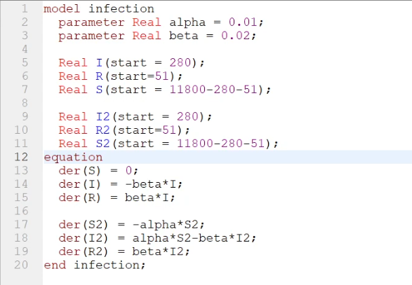
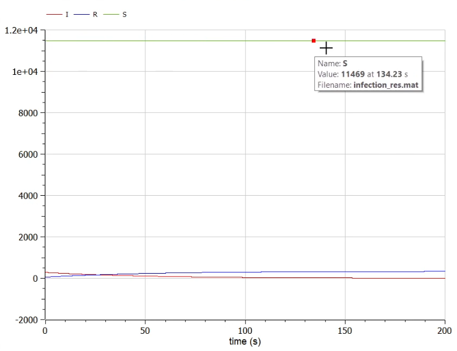
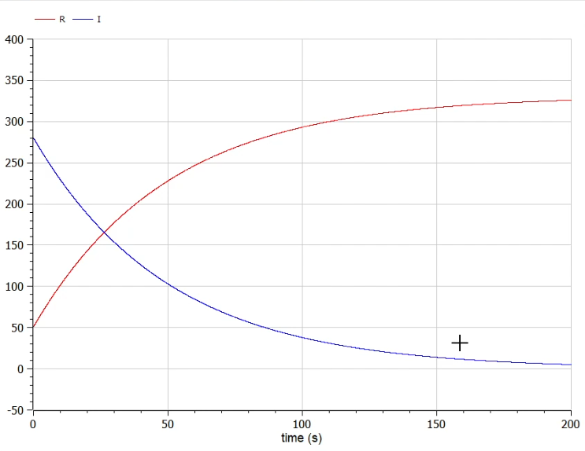
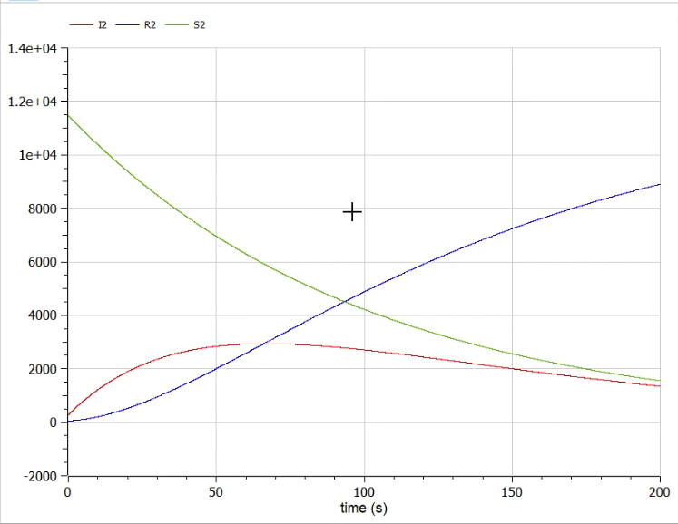

---
## Front matter
lang: ru-RU
title: Презентация по лабораторной работе №6
author: Калинин Тимур Дмитриевич
institute: РУДН
date: 

## Formatting
toc: false
slide_level: 2
theme: metropolis
header-includes: 
 - \metroset{progressbar=frametitle,sectionpage=progressbar,numbering=fraction}
 - '\makeatletter'
 - '\beamer@ignorenonframefalse'
 - '\makeatother'
aspectratio: 43
section-titles: true
---

# Цель выполнения лабораторной работы

Построить модель эпидемии в OpenModelica.

# Задачи выполнения лабораторной работы

## Условия и задача

Вариант 31

На одном острове вспыхнула эпидемия. Известно, что из всех проживающих на острове ($N=11 800$) в момент начала эпидемии ($t=0$) число заболевших людей (являющихся распространителями инфекции) $I(0)=280$, А число здоровых людей с иммунитетом к болезни $R(0)=51$. Таким образом, число людей восприимчивых к болезни, но пока здоровых, в начальный момент времени $S(0)=N-I(0)-R(0)$.

Постройте графики изменения числа особей в каждой из трех групп. Рассмотрите, как будет протекать эпидемия в случае:

1) Если $I(0) \le I^*$
2) Если $I(0) > I^*$

# Результаты выполнения лабораторной

## Код программы

{#fig:001 width=70%}

## График для первого случая

{#fig:003 width=70%}

## График для первого случая

{#fig:004 width=70%}

## Код для второго случая

{#fig:005 width=70%}

# Итог

В результате выполнения лабораторной работы мы познакомились с моделью эпидемии и написали ее реализацию в OpenModelica.
