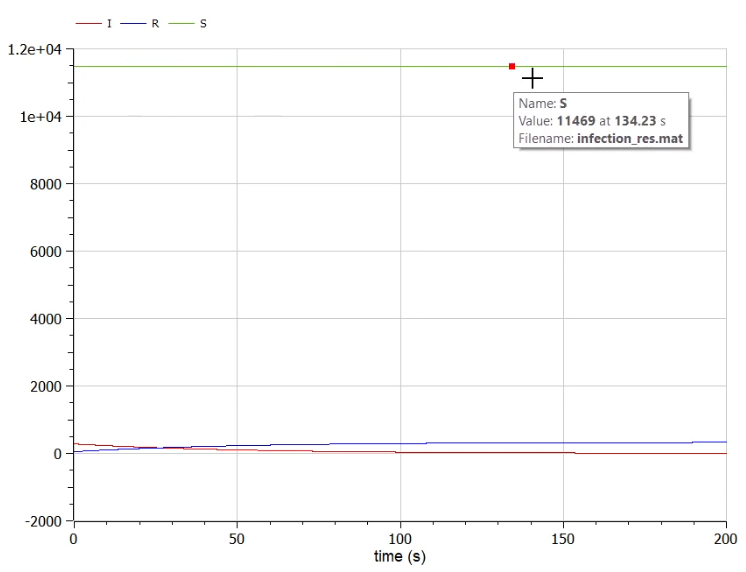
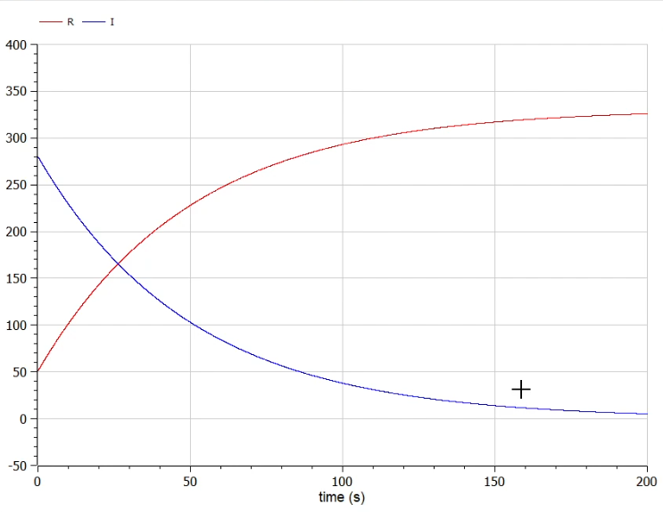
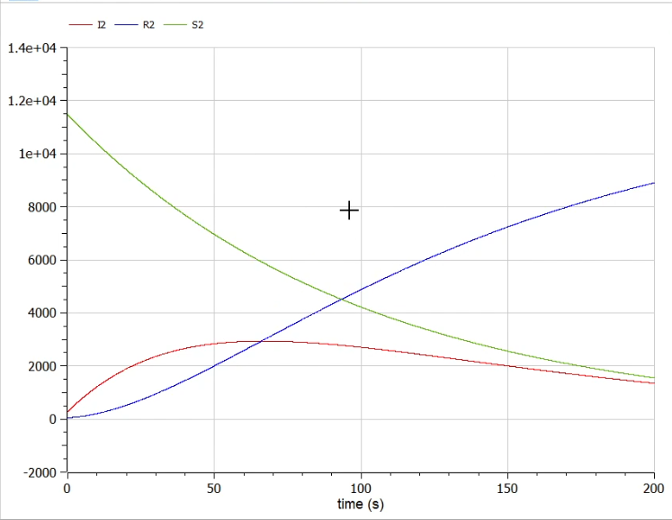

---
# Front matter
title: "Отчёт по лабораторной работе №6"
subtitle: "Модель эпидемии"
author: "Тимур Дмитриевич Калинин"

# Generic otions
lang: ru-RU
toc-title: "Содержание"

# Bibliography

# References settings
linkReferences: true
nameInLink: true

# Pdf output format
toc: true # Table of contents
toc_depth: 2
lof: true # List of figures
lot: false # List of tables
fontsize: 12pt
linestretch: 1.5
papersize: a4
documentclass: scrreprt
## I18n
polyglossia-lang:
  name: russian
  options:
	- spelling=modern
	- babelshorthands=true
polyglossia-otherlangs:
  name: english
### Fonts
mainfont: PT Serif
romanfont: PT Serif
sansfont: PT Sans
monofont: PT Mono
mainfontoptions: Ligatures=TeX
romanfontoptions: Ligatures=TeX
sansfontoptions: Ligatures=TeX,Scale=MatchLowercase
monofontoptions: Scale=MatchLowercase,Scale=0.9
# Biblatex
biblatex: true
biblio-style: "gost-numeric"
biblatexoptions:
  - parentracker=true
  - backend=biber
  - hyperref=auto
  - language=auto
  - autolang=other*
  - citestyle=gost-numeric
## Misc options
indent: true
header-includes:
  - \linepenalty=10 # the penalty added to the badness of each line within a paragraph (no associated penalty node) Increasing the value makes tex try to have fewer lines in the paragraph.
  - \interlinepenalty=0 # value of the penalty (node) added after each line of a paragraph.
  - \hyphenpenalty=50 # the penalty for line breaking at an automatically inserted hyphen
  - \exhyphenpenalty=50 # the penalty for line breaking at an explicit hyphen
  - \binoppenalty=700 # the penalty for breaking a line at a binary operator
  - \relpenalty=500 # the penalty for breaking a line at a relation
  - \clubpenalty=150 # extra penalty for breaking after first line of a paragraph
  - \widowpenalty=150 # extra penalty for breaking before last line of a paragraph
  - \displaywidowpenalty=50 # extra penalty for breaking before last line before a display math
  - \brokenpenalty=100 # extra penalty for page breaking after a hyphenated line
  - \predisplaypenalty=10000 # penalty for breaking before a display
  - \postdisplaypenalty=0 # penalty for breaking after a display
  - \floatingpenalty = 20000 # penalty for splitting an insertion (can only be split footnote in standard LaTeX)
  - \raggedbottom # or \flushbottom
  - \usepackage{float} # keep figures where there are in the text
  - \floatplacement{figure}{H} # keep figures where there are in the text
---

# Цель работы

Построить модель эпидемии в OpenModelica.

# Задание

Вариант 31

На одном острове вспыхнула эпидемия. Известно, что из всех проживающих на острове ($N=11 800$) в момент начала эпидемии ($t=0$) число заболевших людей (являющихся распространителями инфекции) $I(0)=280$, А число здоровых людей с иммунитетом к болезни $R(0)=51$. Таким образом, число людей восприимчивых к болезни, но пока здоровых, в начальный момент времени $S(0)=N-I(0)-R(0)$.

Постройте графики изменения числа особей в каждой из трех групп. Рассмотрите, как будет протекать эпидемия в случае:

1) Если $I(0) \le I^*$
2) Если $I(0) > I^*$

# Теоретическое введение

Рассмотрим простейшую модель эпидемии. Предположим, что некая популяция, состоящая из N особей, (считаем, что популяция изолирована) подразделяется на три группы. Первая группа - это восприимчивые к болезни, но
пока здоровые особи, обозначим их через S(t). Вторая группа – это число инфицированных особей, которые также при этом являются распространителями инфекции, обозначим их I(t). А третья группа, обозначающаяся через R(t) – это
здоровые особи с иммунитетом к болезни.

До того, как число заболевших не превышает критического значения I^*, считаем, что все больные изолированы и не заражают здоровых. Когда I(t) > I^*, тогда инфицирование способны заражать восприимчивых к болезни особей.

Таким образом, скорость изменения числа S(t) меняется по следующему закону:

$$
\frac{dS}{dt}=
\begin{cases}
-{\alpha}S, I(t)>I^* \\
0, I(t){\le}I^*
\end{cases}
$$

Поскольку каждая восприимчивая к болезни особь, которая, в конце концов, заболевает, сама становится инфекционной, то скорость изменения числа инфекционных особей представляет разность за единицу времени между заразившимися и теми, кто уже болеет и лечится, т.е.:

$$
\frac{dI}{dt}=
\begin{cases}
{\alpha}S-{\beta}I, I(t)>I^* \\
-{\beta}I, I(t){\le}I^*
\end{cases}
$$

А скорость изменения выздоравливающих особей (при этом приобретающие иммунитет к болезни)

$$
\frac{dR}{dt}={\beta}I
$$

Постоянные пропорциональности $\alpha$, $\beta$ - это коэффициенты заболеваемости и выздоровления соответственно. Для того, чтобы решения соответствующих уравнений определялось однозначно, необходимо задать начальные условия. Считаем, что на начало эпидемии в момент времени $t=0$ нет особей с иммунитетом к болезни $R(0)=0$, а число инфицированных и восприимчивых к болезни особей $I(0)$ и $S(0)$ соответственно. Для анализа картины протекания эпидемии необходимо рассмотреть два случая: $I(0){\le}I^*$ и $I(t)>I^*$

# Выполнение лабораторной работы

1. Напишем код программы ([Рис. @fig:001]). Программа моделирует сразу оба случая. За первый случай отвечают переменные I, R, S, за второй - I2, R2, S2. Зададим параметры симуляции ([Рис. @fig:002]).

{#fig:001}

{#fig:002}

2. Запустим программу на исполнение. Посмотрим на графики числа особей для первого случая ([Рис. @fig:003]). Как видим, число здоровых особей остается константным. Можно также посмотреть на график без этой константы ([Рис. @fig:004]). Видим, что количество заболевших уменьшается, а количество выздоровевших увеличивается.
   
{#fig:003}

{#fig:004}

3. Посмотрим на графики для второго случая ([Рис. @fig:005]). 

{#fig:005}

# Выводы

В результате выполнения лабораторной работы мы познакомились с моделью эпидемии и написали ее реализацию в OpenModelica.

# Библиография

1. OpenModelica User's Guide. URL: [https://www.openmodelica.org/doc/OpenModelicaUsersGuide/latest/](https://www.openmodelica.org/doc/OpenModelicaUsersGuide/latest/)
2. Лабораторная работа №6. - 4 с. URL: [https://esystem.rudn.ru/mod/resource/view.php?id=831123](https://esystem.rudn.ru/mod/resource/view.php?id=831123)
