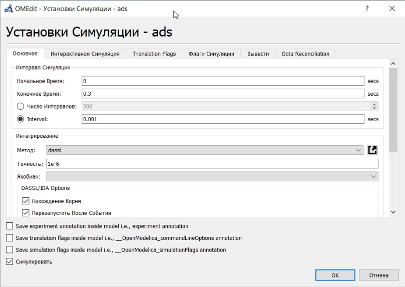
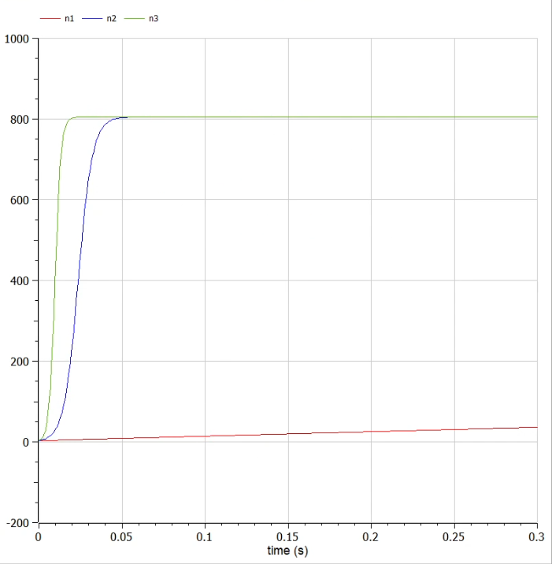
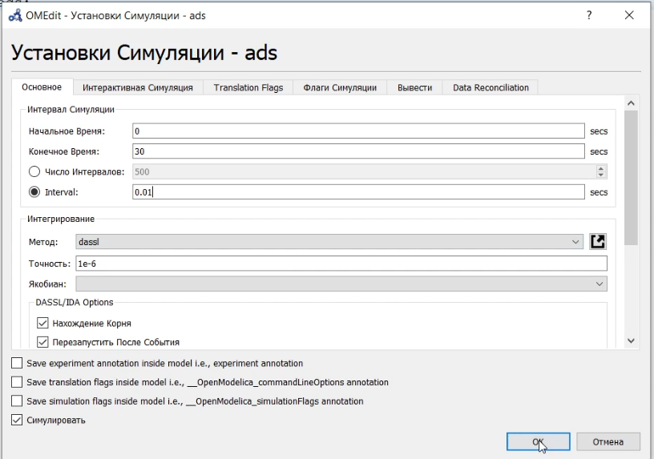

---
## Front matter
lang: ru-RU
title: Презентация по лабораторной работе №7
author: Калинин Тимур Дмитриевич
institute: РУДН
date: 

## Formatting
toc: false
slide_level: 2
theme: metropolis
header-includes: 
 - \metroset{progressbar=frametitle,sectionpage=progressbar,numbering=fraction}
 - '\makeatletter'
 - '\beamer@ignorenonframefalse'
 - '\makeatother'
aspectratio: 43
section-titles: true
---

# Цель выполнения лабораторной работы

Построить модель рекламы в OpenModelica.

# Задачи выполнения лабораторной работы

## Условия и задача

Вариант 31

Постройте график распространения рекламы, математическая модель которой описывается
следующим уравнением:

1. $\frac{dn}{dt}=(0.14+0.00004n(t))(N-n(t))$
   
2. $\frac{dn}{dt}=(0.000015+0.29n(t))(N-n(t))$
   
3. $\frac{dn}{dt}=(0.5sin(0.5t)+0.07cos(0.7t)n(t))(N-n(t))$

При этом объем аудитории $N=805$, в начальный момент о товаре знает 3 человек. Для случая 2 определите в какой момент времени скорость распространения рекламы будет
иметь максимальное значение.

# Результаты выполнения лабораторной

## Код программы

{#fig:001 width=70%}

## Параметры симуляции

{#fig:002 width=70%}

## Графики для трех случаев

{#fig:003 width=70%}

## Параметры симуляции

{#fig:004 width=70%}

## График для первого случая

{#fig:005 width=70%}

## Максимальная скорость распространения рекламы

{#fig:006 width=70%}

# Итог

В результате выполнения лабораторной работы мы познакомились с моделью рекламы и написали ее реализацию в OpenModelica.
