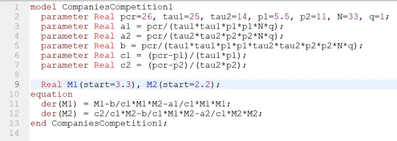
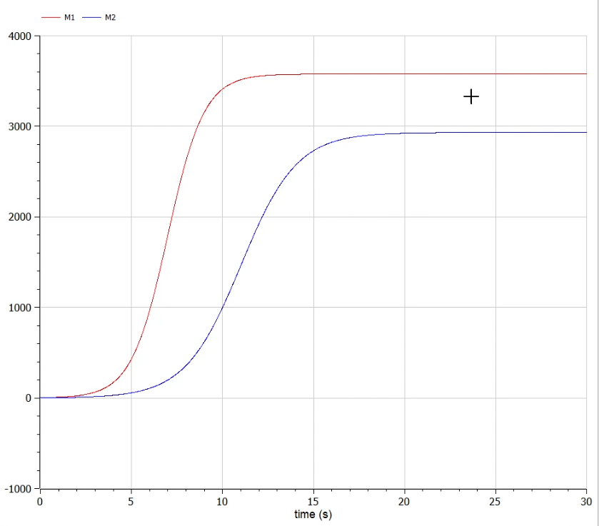
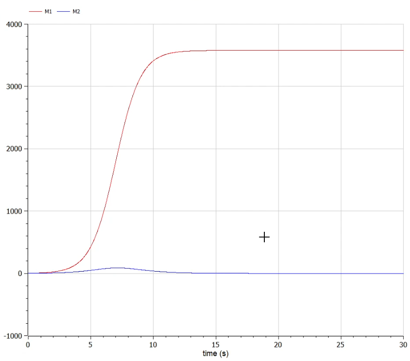

---
## Front matter
lang: ru-RU
title: Презентация по лабораторной работе №8
author: Калинин Тимур Дмитриевич
institute: РУДН
date: 

## Formatting
toc: false
slide_level: 2
theme: metropolis
header-includes: 
 - \metroset{progressbar=frametitle,sectionpage=progressbar,numbering=fraction}
 - '\makeatletter'
 - '\beamer@ignorenonframefalse'
 - '\makeatother'
aspectratio: 43
section-titles: true
---

# Цель выполнения лабораторной работы

Построить модель конкуренции двух фирм в OpenModelica.

# Задачи выполнения лабораторной работы

## Условия и задача

Вариант 32

Случай 1. Рассмотрим две фирмы, производящие взаимозаменяемые товары одинакового качества и находящиеся в одной рыночной нише. Считаем, что в рамках нашей модели конкурентная борьба ведётся только рыночными методами. То есть, конкуренты могут влиять на противника путем изменения параметров своего производства: себестоимость, время цикла, но не могут прямо вмешиваться в ситуацию на рынке («назначать» цену или влиять на потребителей каким-либо иным способом.) 

---

Будем считать, что постоянные издержки пренебрежимо малы, и в модели учитывать не будем. В этом случае динамика изменения объемов продаж фирмы 1 и фирмы 2 описывается следующей системой уравнений:

$$
\frac{dM_1}{d\theta}=M_1-\frac{b}{c_1}M_1M_2-\frac{a_1}{c_1}M_1^2
$$

$$
\frac{dM_2}{d\theta}=\frac{c_2}{c_1}M_2-\frac{b}{c_1}M_1M_2-\frac{a_2}{c_1}M_2^2
$$

где $a_1=\frac{p_{cr}}{{{\tau}_1^2}{\tilde{p}_1^2}Nq}$, 
$a_2=\frac{p_{cr}}{{{\tau}_2^2}{\tilde{p}_2^2}Nq}$
$b=\frac{p_{cr}}{{{\tau}_1^2}{\tilde{p}_1^2}{{\tau}_2^2}{\tilde{p}_2^2}Nq}$
$c_1=\frac{p_{cr}-\tilde{p}_1}{{\tau}_1\tilde{p}_1}$
$c_2=\frac{p_{cr}-\tilde{p}_2}{{\tau}_2\tilde{p}_2}$

Также введена нормировка $t=c_1\theta$

---

Случай 2. Рассмотрим модель, когда, помимо экономического фактора влияния (изменение себестоимости, производственного цикла, использование кредита и т.п.), используются еще и социально-психологические факторы – формирование общественного предпочтения одного товара другому, не зависимо от их качества и цены. В этом случае взаимодействие двух фирм будет зависеть друг от друга, соответственно коэффициент перед $M_1M_2$ будет отличаться. Пусть в рамках рассматриваемой модели динамика изменения объемов продаж фирмы 1 и фирмы 2 описывается следующей системой уравнений:

$$
\frac{dM_1}{d\theta}=M_1-\frac{b}{c_1}M_1M_2-\frac{a_1}{c_1}M_1^2
$$

$$
\frac{dM_2}{d\theta}=\frac{c_2}{c_1}M_2-(\frac{b}{c_1}+0.00033)M_1M_2-\frac{a_2}{c_1}M_2^2
$$

# Результаты выполнения лабораторной

## Код программы

{#fig:001 width=70%}

## Параметры симуляции

{#fig:002 width=70%}

## График для первого случая

{#fig:003 width=70%}

## Код программы для второго случая

{#fig:004 width=70%}

## Графики для второго случая

{#fig:005 width=70%}

# Итог

В результате выполнения лабораторной работы мы познакомились с моделью конкуренции двух фирм и написали ее реализацию в OpenModelica.
