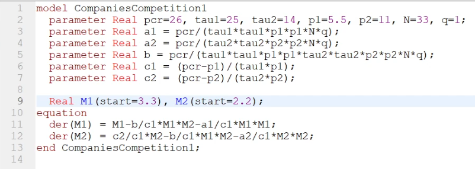
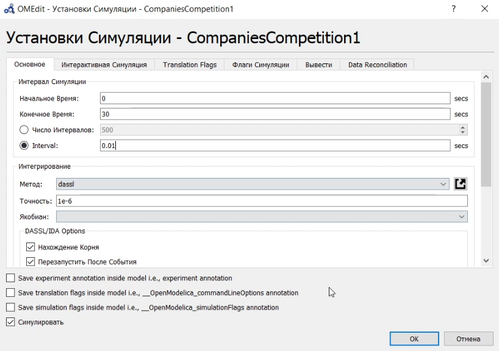
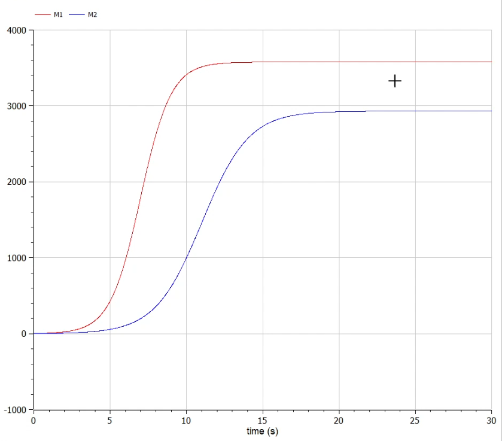
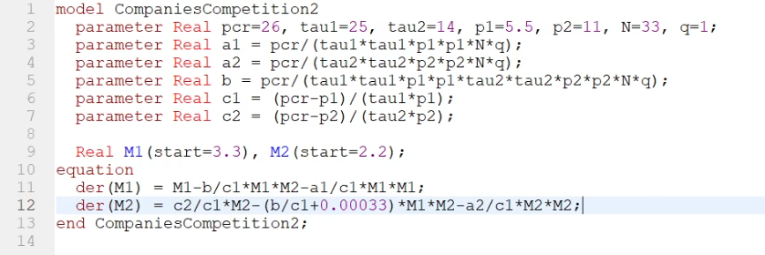
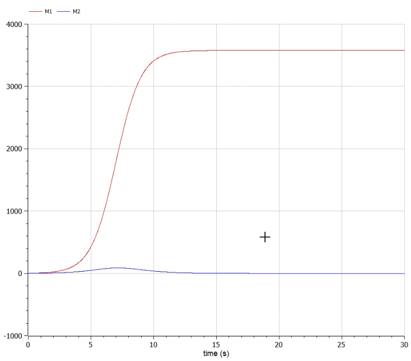

---
# Front matter
title: "Отчёт по лабораторной работе №8"
subtitle: "Модель конкуренции двух фирм"
author: "Тимур Дмитриевич Калинин"

# Generic otions
lang: ru-RU
toc-title: "Содержание"

# Bibliography

# References settings
linkReferences: true
nameInLink: true

# Pdf output format
toc: true # Table of contents
toc_depth: 2
lof: true # List of figures
lot: false # List of tables
fontsize: 12pt
linestretch: 1.5
papersize: a4
documentclass: scrreprt
## I18n
polyglossia-lang:
  name: russian
  options:
	- spelling=modern
	- babelshorthands=true
polyglossia-otherlangs:
  name: english
### Fonts
mainfont: PT Serif
romanfont: PT Serif
sansfont: PT Sans
monofont: PT Mono
mainfontoptions: Ligatures=TeX
romanfontoptions: Ligatures=TeX
sansfontoptions: Ligatures=TeX,Scale=MatchLowercase
monofontoptions: Scale=MatchLowercase,Scale=0.9
# Biblatex
biblatex: true
biblio-style: "gost-numeric"
biblatexoptions:
  - parentracker=true
  - backend=biber
  - hyperref=auto
  - language=auto
  - autolang=other*
  - citestyle=gost-numeric
## Misc options
indent: true
header-includes:
  - \linepenalty=10 # the penalty added to the badness of each line within a paragraph (no associated penalty node) Increasing the value makes tex try to have fewer lines in the paragraph.
  - \interlinepenalty=0 # value of the penalty (node) added after each line of a paragraph.
  - \hyphenpenalty=50 # the penalty for line breaking at an automatically inserted hyphen
  - \exhyphenpenalty=50 # the penalty for line breaking at an explicit hyphen
  - \binoppenalty=700 # the penalty for breaking a line at a binary operator
  - \relpenalty=500 # the penalty for breaking a line at a relation
  - \clubpenalty=150 # extra penalty for breaking after first line of a paragraph
  - \widowpenalty=150 # extra penalty for breaking before last line of a paragraph
  - \displaywidowpenalty=50 # extra penalty for breaking before last line before a display math
  - \brokenpenalty=100 # extra penalty for page breaking after a hyphenated line
  - \predisplaypenalty=10000 # penalty for breaking before a display
  - \postdisplaypenalty=0 # penalty for breaking after a display
  - \floatingpenalty = 20000 # penalty for splitting an insertion (can only be split footnote in standard LaTeX)
  - \raggedbottom # or \flushbottom
  - \usepackage{float} # keep figures where there are in the text
  - \floatplacement{figure}{H} # keep figures where there are in the text
---

# Цель работы

Построить модель конкуренции двух фирм в OpenModelica.

# Задание

Вариант 32

Случай 1. Рассмотрим две фирмы, производящие взаимозаменяемые товары одинакового качества и находящиеся в одной рыночной нише. Считаем, что в рамках нашей модели конкурентная борьба ведётся только рыночными методами. То есть, конкуренты могут влиять на противника путем изменения параметров своего производства: себестоимость, время цикла, но не могут прямо вмешиваться в ситуацию на рынке («назначать» цену или влиять на потребителей каким-либо иным способом.) Будем считать, что постоянные издержки = пренебрежимо малы, и в модели учитывать не будем. В этом случае динамика изменения объемов продаж фирмы 1 и фирмы 2 описывается следующей системой уравнений:

$$
\frac{dM_1}{d\theta}=M_1-\frac{b}{c_1}M_1M_2-\frac{a_1}{c_1}M_1^2
$$

$$
\frac{dM_2}{d\theta}=\frac{c_2}{c_1}M_2-\frac{b}{c_1}M_1M_2-\frac{a_2}{c_1}M_2^2
$$

где $a_1=\frac{p_{cr}}{{{\tau}_1^2}{\tilde{p}_1^2}Nq}$, 
$a_2=\frac{p_{cr}}{{{\tau}_2^2}{\tilde{p}_2^2}Nq}$
$b=\frac{p_{cr}}{{{\tau}_1^2}{\tilde{p}_1^2}{{\tau}_2^2}{\tilde{p}_2^2}Nq}$
$c_1=\frac{p_{cr}-\tilde{p}_1}{{\tau}_1\tilde{p}_1}$
$c_2=\frac{p_{cr}-\tilde{p}_2}{{\tau}_2\tilde{p}_2}$

Также введена нормировка $t=c_1\theta$

Случай 2. Рассмотрим модель, когда, помимо экономического фактора влияния (изменение себестоимости, производственного цикла, использование кредита и т.п.), используются еще и социально-психологические факторы – формирование общественного предпочтения одного товара другому, не зависимо от их качества и цены. В этом случае взаимодействие двух фирм будет зависеть друг от друга, соответственно коэффициент перед $M_1M_2$ будет отличаться. Пусть в рамках рассматриваемой модели динамика изменения объемов продаж фирмы 1 и фирмы 2 описывается следующей системой уравнений:

$$
\frac{dM_1}{d\theta}=M_1-\frac{b}{c_1}M_1M_2-\frac{a_1}{c_1}M_1^2
$$

$$
\frac{dM_2}{d\theta}=\frac{c_2}{c_1}M_2-(\frac{b}{c_1}+0.00033)M_1M_2-\frac{a_2}{c_1}M_2^2
$$

# Теоретическое введение

## Конкуренция одной фирмы

Для построения модели конкуренции хотя бы двух фирм необходимо
рассмотреть модель одной фирмы. Вначале рассмотрим модель фирмы,
производящей продукт долговременного пользования, когда цена его определяется
балансом спроса и предложения. Примем, что этот продукт занимает
определенную нишу рынка и конкуренты в ней отсутствуют.

Обозначим:
$N$ – число потребителей производимого продукта.
$S$ – доходы потребителей данного продукта. Считаем, что доходы всех
потребителей одинаковы. Это предположение справедливо, если речь идет об
одной рыночной нише, т.е. производимый продукт ориентирован на определенный
слой населения.
$M$ – оборотные средства предприятия
$\tau$ – длительность производственного цикла
$p$ – рыночная цена товара
$\tilde{p}$ – себестоимость продукта, то есть переменные издержки на производство
единицы продукции.
$\delta$ – доля оборотных средств, идущая на покрытие переменных издержек.
$\kappa$ – постоянные издержки, которые не зависят от количества выпускаемой
продукции.

В конечном итоге уравнение динамики оборотных средств примет вид:

$$
\frac{dM}{dt}=M\frac{\delta}{\tau}(\frac{p_{cr}}{\tilde{p}}-1)-M^2{(\frac{\delta}{\tau\tilde{p}})}^2\frac{p_{cr}{Nq}}-\kappa
$$

## Конкуренция двух фирм

Рассмотрим две фирмы, производящие взаимозаменяемые товары одинакового качества и находящиеся в одной рыночной нише. Последнее означает, что у потребителей в этой нише нет априорных предпочтений, и они приобретут тот или иной товар, не обращая внимания на знак фирмы. В этом случае, на рынке устанавливается единая цена, которая определяется балансом суммарного предложения и спроса. Иными словами, в рамках нашей модели конкурентная борьба ведётся только рыночными методами. То есть, конкуренты могут влиять на противника путем изменения параметров своего производства: себестоимость, время цикла, но не могут прямо вмешиваться в ситуацию на рынке («назначать» цену или влиять на потребителей каким-либо иным способом.)

Проведя аналогичные рассуждения и условившись, что постоянными издержками можно пренебречь, а также введя нормировку $t=c_1\theta$ получим систему:

$$
\frac{dM_1}{d\theta}=M_1-\frac{b}{c_1}M_1M_2-\frac{a_1}{c_1}M_1^2
$$

$$
\frac{dM_2}{d\theta}=\frac{c_2}{c_1}M_2-\frac{b}{c_1}M_1M_2-\frac{a_2}{c_1}M_2^2
$$

где $a_1=\frac{p_{cr}}{{{\tau}_1^2}{\tilde{p}_1^2}Nq}$, 
$a_2=\frac{p_{cr}}{{{\tau}_2^2}{\tilde{p}_2^2}Nq}$
$b=\frac{p_{cr}}{{{\tau}_1^2}{\tilde{p}_1^2}{{\tau}_2^2}{\tilde{p}_2^2}Nq}$
$c_1=\frac{p_{cr}-\tilde{p}_1}{{\tau}_1\tilde{p}_1}$
$c_2=\frac{p_{cr}-\tilde{p}_2}{{\tau}_2\tilde{p}_2}$

Чтобы решить такую систему необходимо знать начальные условия.

Теперь рассмотрим второй случай. Рассмотрим модель, когда, помимо экономического фактора влияния (изменение себестоимости, производственного цикла, использование кредита и т.п.), используются еще и социально-психологические факторы – формирование общественного предпочтения одного товара другому, не зависимо от их качества и цены. В этом случае взаимодействие двух фирм будет зависеть друг от друга, соответственно коэффициент перед $M_1M_2$ будет отличаться.

Такая модель может выглядеть, к примеру, так: 

$$
\frac{dM_1}{d\theta}=M_1-\frac{b}{c_1}M_1M_2-\frac{a_1}{c_1}M_1^2
$$

$$
\frac{dM_2}{d\theta}=\frac{c_2}{c_1}M_2-(\frac{b}{c_1}+0.002)M_1M_2-\frac{a_2}{c_1}M_2^2
$$

# Выполнение лабораторной работы

1. Напишем код программы для первого случая ([Рис. @fig:001]). Зададим параметры симуляции ([Рис. @fig:002]).

{#fig:001}

{#fig:002}

2. Запустим программу на исполнение. Посмотрим на графики измнения объема продаж ([Рис. @fig:003]). Как видим, оба графика имеют одинаковую форму, но быстрее растет первая фирма.
   
{#fig:003}

3. Напишем аналогичную программу для второго случая. ([Рис. @fig:004]). Запустим ее с такими параметрами симуляции и посмотрим на графики изменения объема продаж ([Рис. @fig:005]). Как видим, теперь вторая фирма растет, однако со временем достигает своего максимума, после чего оборотные средства начинают падать, пока в конце концов не становятся равными нулю.

{#fig:004}

{#fig:005}

# Выводы

В результате выполнения лабораторной работы мы познакомились с моделью конкуренции двух фирм и написали ее реализацию в OpenModelica.

# Библиография

1. OpenModelica User's Guide. URL: [https://www.openmodelica.org/doc/OpenModelicaUsersGuide/latest/](https://www.openmodelica.org/doc/OpenModelicaUsersGuide/latest/)
2. Лабораторная работа №8. - 4 с. URL: [https://esystem.rudn.ru/mod/resource/view.php?id=831131](https://esystem.rudn.ru/mod/resource/view.php?id=831131)
